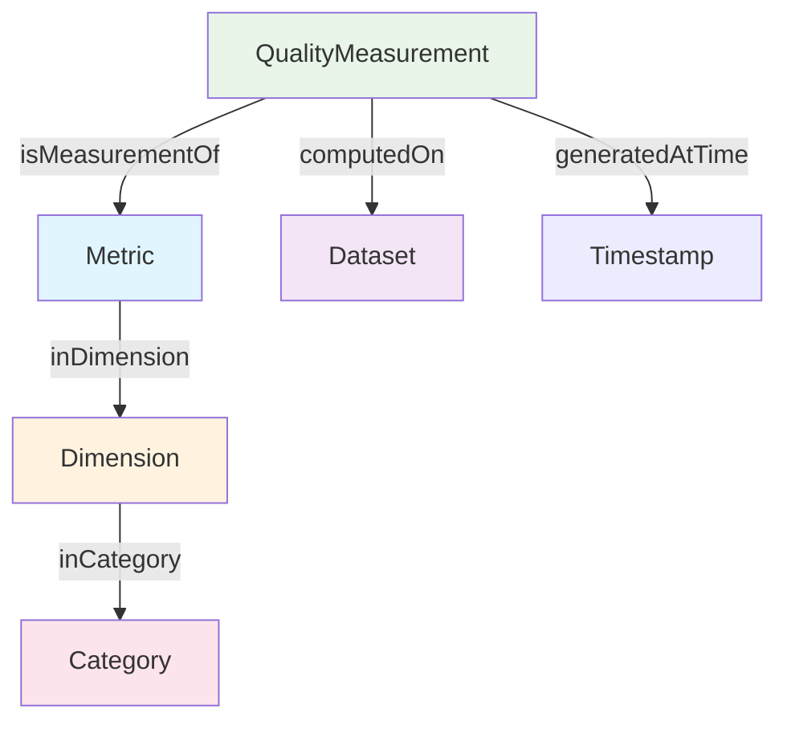
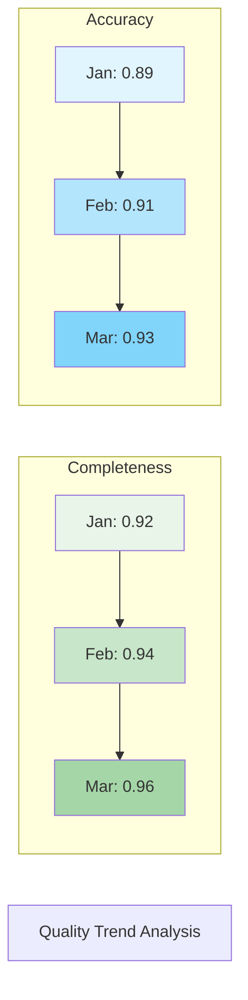
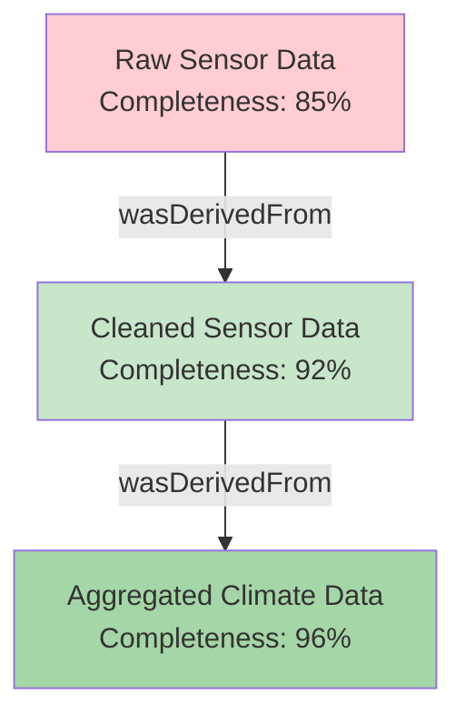

# Chapter 2: Data Quality (DQV)


## 2.1 Theory and Concepts

Data quality represents the cornerstone of trustworthy data ecosystems. While previous chapters explored how to describe datasets and trace their provenance, this chapter addresses the critical question of how good that data actually is. The Data Quality Vocabulary (DQV) provides a standardized framework for assessing, documenting, and communicating data quality information in a way that enables data consumers to make informed decisions about data usage.

### What is DQV?

The Data Quality Vocabulary (DQV) is a W3C Recommendation that defines a set of classes and properties for representing data quality information. DQV enables data publishers to express quality assessments, measurements, and annotations in a standardized format that can be understood and processed by both humans and machines. The vocabulary supports a wide range of quality assessment approaches, from automated metrics to human evaluations, from single measurements to comprehensive quality certificates.

DQV addresses the fundamental challenge of data quality communication: how do we express that data is good or bad, complete or incomplete, accurate or inaccurate, in a way that is meaningful, comparable, and actionable? The vocabulary provides the semantic foundation for answering these questions while maintaining flexibility to accommodate diverse quality assessment methodologies and domain-specific requirements.

### Core DQV Concepts

DQV is built around a hierarchical framework that organizes quality information into meaningful categories. At the foundation are **Metrics**, which define specific measurable aspects of data quality such as completeness, accuracy, or availability. These metrics are applied to datasets through **QualityMeasurements**, which capture the actual observed values and the context in which they were measured.

The metrics themselves are organized into **Dimensions**, which group related metrics into broader quality categories. Common dimensions include completeness (how much data is missing), accuracy (how correct the data is), availability (whether the data can be accessed), and timeliness (how current the data is). These dimensions can be further organized into **Categories** that represent high-level quality frameworks such as ISO 25012 or domain-specific quality models.



This hierarchical structure enables both detailed quality assessments and high-level quality summaries. Data consumers can drill down to specific metric values for detailed analysis, or examine dimension-level summaries for quick quality assessments. The framework also supports quality annotations that capture user feedback, expert evaluations, and quality certificates that provide formal attestations of data quality.

### Quality Dimensions and Their Importance

Different applications and domains prioritize different quality dimensions. Understanding these dimensions helps data publishers focus their quality assessment efforts on the aspects that matter most to their users.

**Completeness** measures the presence of expected data elements. Incomplete data can lead to biased analyses and incorrect conclusions. For example, a dataset with missing demographic information may not be suitable for population studies.

**Accuracy** measures how closely data values represent the real-world phenomena they describe. Inaccurate data can undermine decision making and lead to costly errors. GPS coordinates with systematic bias, for instance, could misguide navigation systems.

**Availability** measures whether data can be accessed when needed. Even high-quality data is useless if it cannot be retrieved. This dimension includes both technical accessibility and licensing accessibility.

**Timeliness** measures how current the data is relative to the needs of the application. Financial market data from yesterday may be too old for trading decisions, while historical climate data from decades ago may be perfectly suitable for climate change studies.

**Consistency** measures the absence of contradictions within and across datasets. Inconsistent data can confuse automated systems and lead to incorrect inferences. A customer database with different addresses for the same customer in different tables exemplifies consistency issues.

### DQV Integration with DCAT and PROV

DQV builds upon the foundations established in previous chapters. While DCAT (Chapter 1) describes what datasets are available and how to access them, DQV tells us how good those datasets are for their intended purposes. This integration creates a comprehensive view of data resources that includes descriptive metadata and quality assessments. Provenance information will be covered in Chapter 3.

The integration works through quality annotations that link to DCAT datasets and distributions. Each quality measurement is associated with a specific dataset or distribution, creating a clear connection between quality information and the data resource it describes. This enables data consumers to evaluate quality alongside other metadata when making decisions about data usage.

PROV provenance information enhances quality assessments by providing context for quality measurements. When a dataset is derived from high-quality source data, consumers may have greater confidence in its quality. Conversely, datasets derived from low-quality sources may require additional scrutiny. The combination of provenance and quality information creates a complete picture of data trustworthiness.

## 2.2 DQV in Simple Data Catalog

Simple Data Catalog implements a practical subset of DQV that focuses on the most commonly needed quality assessment capabilities. The implementation provides a straightforward interface for defining metrics, capturing measurements, and organizing quality information while maintaining compatibility with the DQV standard.

The framework supports both automated quality assessments and manual quality evaluations. Automated assessments can be captured through programmatic metric calculations, while manual evaluations can be documented through quality annotations and expert assessments. This flexibility accommodates diverse quality assessment workflows and organizational capabilities.

### Quality Measurement Framework

The simple_data_catalog_model provides three main classes for quality information: `Metric`, `QualityMeasurement`, and quality annotations on datasets. The `Metric` class defines specific quality aspects that can be measured, including their definitions, expected data types, and organizational categorization. The `QualityMeasurement` class captures actual observations of those metrics applied to specific datasets.

```yaml
# Example metric definition
metrics:
  - identifier: "completeness-ratio"
    definition: "Ratio of non-null values to total expected values"
    prefLabel: "Completeness Ratio"
    expectedDataType: "xsd:double"
    inDimension: "completeness"
```

The framework supports multiple data types for metric values, including boolean values for pass/fail assessments, numeric values for continuous measurements, and string values for categorical assessments. This flexibility enables diverse quality assessment approaches while maintaining standardized representation.

### Metric Definitions and Calculations

Metrics in Simple Data Catalog can be defined at multiple levels of specificity. Some metrics may be generic and applicable across domains, such as availability or completeness ratios. Other metrics may be domain-specific, such as spatial accuracy for geographic data or temporal consistency for time-series data.

The framework supports both simple metrics that capture single values and complex metrics that may involve multiple calculations or sub-metrics. For example, a data quality index might combine several individual metrics into a single composite score. These complex metrics can be documented through their definitions and relationships to simpler metrics.

```yaml
# Complex metric example
metrics:
  - identifier: "overall-quality-index"
    definition: "Weighted combination of completeness, accuracy, and availability metrics"
    prefLabel: "Overall Quality Index"
    expectedDataType: "xsd:double"
    inDimension: "overall-quality"
    # Calculation method documented in description
```

### Quality Reporting Structures

Quality measurements are organized to support both detailed analysis and summary reporting. Individual measurements can be aggregated at the dimension level to provide quality overviews, or examined in detail for specific quality issues. The framework supports trend analysis by capturing measurement timestamps, enabling quality monitoring over time.

The reporting structure also supports quality certificates and compliance attestations. These formal quality statements can be documented alongside metric measurements, providing both quantitative assessments and qualitative evaluations. This combination supports comprehensive quality communication that addresses both technical quality requirements and business quality expectations.

## 2.3 Practical Examples

### 2.3.1 Basic Quality Measurements

The simplest quality assessment scenario involves measuring a single metric for a dataset. This example demonstrates the fundamental DQV concepts in action, showing how to document basic quality information that helps users evaluate dataset fitness for purpose.

```yaml
# Basic quality measurement example - LinkML compliant
datasets:
  - identifier: "temperature-readings"
    title: "Daily Temperature Readings"
    description: "Temperature measurements collected from weather station"
    publisher:
      name: "Weather Service"
    issued: "2024-01-15"
    modified: "2024-01-20"
    distribution:
      - identifier: "csv-data"
        title: "CSV format"
        description: "Temperature data in CSV format"
        accessURL: "https://data.gov.climate/temperature.csv"
        format: "text/csv"

metrics:
  - identifier: "availability-check"
    definition: "Binary check if dataset is accessible via its distributions"
    prefLabel: "Availability Check"
    expectedDataType: "xsd:boolean"
    inDimension: "availability"

qualityMeasurements:
  - identifier: "availability-measurement-2024-01-15"
    computedOn: "temperature-readings"
    isMeasurementOf: "availability-check"
    value: true
    generatedAtTime: "2024-01-15T10:30:00Z"

dataCatalog:
  title: "Environmental Data Catalog"
  description: "Catalog of environmental monitoring datasets"
  publisher:
    name: "Weather Data Service"
```

This example shows a basic availability measurement for the temperature readings dataset. The metric defines what is being measured (availability), and the quality measurement captures the actual observation (true, indicating the dataset is accessible). The measurement includes a timestamp, enabling quality tracking over time.

### 2.3.2 Multiple Quality Metrics

Real-world quality assessments typically involve multiple metrics across different quality dimensions. This example demonstrates how to capture comprehensive quality information that provides a complete picture of dataset quality.

```yaml
# Multiple quality metrics example - LinkML compliant
concepts:
  - identifier: "air-quality"
    prefLabel: "Air Quality"
    definition: "The degree to which air is suitable for breathing and other uses"
  - identifier: "pollution"
    prefLabel: "Pollution"
    definition: "The introduction of contaminants into natural environment"
  - identifier: "urban"
    prefLabel: "Urban"
    definition: "Relating to or characteristic of a city or town"

datasets:
  - identifier: "air-quality-data"
    title: "Urban Air Quality Measurements"
    description: "Air quality index measurements from urban monitoring stations"
    theme:
      - "air-quality"
      - "pollution"
      - "urban"
    publisher:
      name: "Environmental Protection Agency"
    contactPoint:
      hasEmail: "data@epa.gov"
    issued: "2024-01-15"
    modified: "2024-01-20"
    wasDerivedFrom:
      - "raw-sensor-readings"

metrics:
  - identifier: "completeness-ratio"
    definition: "Ratio of non-null values to total expected values"
    prefLabel: "Completeness Ratio"
    expectedDataType: "xsd:double"
    inDimension: "completeness"

  - identifier: "accuracy-percentage"
    definition: "Percentage of values that pass accuracy validation"
    prefLabel: "Accuracy Percentage"
    expectedDataType: "xsd:double"
    inDimension: "accuracy"

  - identifier: "timeliness-score"
    definition: "Score based on data recency relative to expected update frequency"
    prefLabel: "Timeliness Score"
    expectedDataType: "xsd:double"
    inDimension: "timeliness"

qualityMeasurements:
  - identifier: "completeness-measurement-2024-01-15"
    computedOn: "air-quality-data"
    isMeasurementOf: "completeness-ratio"
    value: 0.95
    generatedAtTime: "2024-01-15T10:30:00Z"

  - identifier: "accuracy-measurement-2024-01-15"
    computedOn: "air-quality-data"
    isMeasurementOf: "accuracy-percentage"
    value: 0.87
    generatedAtTime: "2024-01-15T10:30:00Z"

  - identifier: "timeliness-measurement-2024-01-15"
    computedOn: "air-quality-data"
    isMeasurementOf: "timeliness-score"
    value: 0.92
    generatedAtTime: "2024-01-15T10:30:00Z"

dataCatalog:
  title: "Environmental Data Catalog"
  description: "Catalog of environmental monitoring datasets"
  publisher:
    name: "Environmental Protection Agency"
```

This example shows comprehensive quality assessment for an air quality dataset, measuring three different quality dimensions. The completeness ratio of 0.95 indicates that 95% of expected data values are present, the accuracy percentage of 0.87 shows that 87% of values pass accuracy validation, and the timeliness score of 0.92 indicates relatively current data. Together, these measurements provide a complete quality picture that helps users evaluate the dataset for their specific needs.

### 2.3.3 Quality Dimensions and Categories

Organizing metrics into dimensions and categories helps users understand quality assessments in context. This example demonstrates how to structure quality information using standard quality frameworks.

```yaml
# Quality dimensions and categories example
datasets:
  - identifier: "population-census"
    title: "Annual Population Census"
    description: "Demographic data collected through annual census surveys"
    keywords:
      - demographics
      - population
      - census
    publisher:
      name: "National Statistics Office"
    issued: "2024-01-15"
    modified: "2024-01-20"

metrics:
  # Completeness dimension
  - identifier: "record-completeness"
    definition: "Percentage of complete records in the dataset"
    prefLabel: "Record Completeness"
    expectedDataType: "xsd:double"
    inDimension: "completeness"

  - identifier: "field-completeness"
    definition: "Percentage of non-null values across all fields"
    prefLabel: "Field Completeness"
    expectedDataType: "xsd:double"
    inDimension: "completeness"

  # Accuracy dimension
  - identifier: "format-accuracy"
    definition: "Percentage of values in correct format"
    prefLabel: "Format Accuracy"
    expectedDataType: "xsd:double"
    inDimension: "accuracy"

  - identifier: "value-accuracy"
    definition: "Percentage of values within expected ranges"
    prefLabel: "Value Accuracy"
    expectedDataType: "xsd:double"
    inDimension: "accuracy"

  # Consistency dimension
  - identifier: "internal-consistency"
    definition: "Percentage of records without internal contradictions"
    prefLabel: "Internal Consistency"
    expectedDataType: "xsd:double"
    inDimension: "consistency"

qualityMeasurements:
  - identifier: "record-completeness-measurement"
    computedOn: "population-census"
    isMeasurementOf: "record-completeness"
    value: 0.98
    generatedAtTime: "2024-01-15T10:30:00Z"

  - identifier: "field-completeness-measurement"
    computedOn: "population-census"
    isMeasurementOf: "field-completeness"
    value: 0.94
    generatedAtTime: "2024-01-15T10:30:00Z"

  - identifier: "format-accuracy-measurement"
    computedOn: "population-census"
    isMeasurementOf: "format-accuracy"
    value: 0.99
    generatedAtTime: "2024-01-15T10:30:00Z"

  - identifier: "value-accuracy-measurement"
    computedOn: "population-census"
    isMeasurementOf: "value-accuracy"
    value: 0.96
    generatedAtTime: "2024-01-15T10:30:00Z"

  - identifier: "internal-consistency-measurement"
    computedOn: "population-census"
    isMeasurementOf: "internal-consistency"
    value: 0.97
    generatedAtTime: "2024-01-15T10:30:00Z"

dataCatalog:
  title: "National Data Catalog"
  description: "Catalog of national statistical datasets"
  publisher:
    name: "National Statistics Office"
```

This example demonstrates quality assessment organized across three dimensions: completeness, accuracy, and consistency. Each dimension includes multiple specific metrics that provide detailed quality information. The dimension-level organization helps users understand quality patterns and identify areas that may need attention or improvement.

### 2.3.4 Quality Trend Analysis

Quality often changes over time as datasets are updated, processed, or maintained. Tracking quality trends helps users understand data reliability and identify potential quality issues. This example shows how to capture quality measurements over time to support trend analysis.

```yaml
# Quality trend analysis example
datasets:
  - identifier: "climate-data"
    title: "Monthly Climate Data"
    description: "Climate measurements updated monthly"
    keywords:
      - climate
      - weather
      - environmental
    publisher:
      name: "Climate Data Center"
    issued: "2024-01-01"
    modified: "2024-03-31"

metrics:
  - identifier: "completeness-ratio"
    definition: "Ratio of non-null values to total expected values"
    prefLabel: "Completeness Ratio"
    expectedDataType: "xsd:double"
    inDimension: "completeness"

  - identifier: "accuracy-percentage"
    definition: "Percentage of values that pass accuracy validation"
    prefLabel: "Accuracy Percentage"
    expectedDataType: "xsd:double"
    inDimension: "accuracy"

qualityMeasurements:
  # January measurements
  - identifier: "completeness-jan-2024"
    computedOn: "climate-data"
    isMeasurementOf: "completeness-ratio"
    value: 0.92
    generatedAtTime: "2024-01-31T23:59:59Z"

  - identifier: "accuracy-jan-2024"
    computedOn: "climate-data"
    isMeasurementOf: "accuracy-percentage"
    value: 0.89
    generatedAtTime: "2024-01-31T23:59:59Z"

  # February measurements
  - identifier: "completeness-feb-2024"
    computedOn: "climate-data"
    isMeasurementOf: "completeness-ratio"
    value: 0.94
    generatedAtTime: "2024-02-29T23:59:59Z"

  - identifier: "accuracy-feb-2024"
    computedOn: "climate-data"
    isMeasurementOf: "accuracy-percentage"
    value: 0.91
    generatedAtTime: "2024-02-29T23:59:59Z"

  # March measurements
  - identifier: "completeness-mar-2024"
    computedOn: "climate-data"
    isMeasurementOf: "completeness-ratio"
    value: 0.96
    generatedAtTime: "2024-03-31T23:59:59Z"

  - identifier: "accuracy-mar-2024"
    computedOn: "climate-data"
    isMeasurementOf: "accuracy-percentage"
    value: 0.93
    generatedAtTime: "2024-03-31T23:59:59Z"

dataCatalog:
  title: "Climate Data Catalog"
  description: "Catalog of climate and environmental datasets"
  publisher:
    name: "Climate Data Center"
```

This example shows quality measurements captured over three months, revealing improvement trends in both completeness (from 0.92 to 0.96) and accuracy (from 0.89 to 0.93). Such trend analysis helps users understand data reliability and can inform decisions about when to use the data or when additional quality validation may be needed.



### 2.3.5 Integration with Provenance

Quality assessments become more meaningful when combined with provenance information. This example shows how quality measurements can be interpreted in the context of data derivation chains, helping users understand how quality evolves through data processing workflows.

```yaml
# Quality with provenance integration example
datasets:
  - identifier: "raw-sensor-data"
    title: "Raw Weather Station Sensor Data"
    description: "Direct readings from weather station sensors"
    publisher:
      name: "Weather Station Network"

  - identifier: "cleaned-sensor-data"
    title: "Cleaned Weather Station Data"
    description: "Sensor data after automated cleaning and validation"
    publisher:
      name: "Weather Data Processing Center"
    wasDerivedFrom:
      - "raw-sensor-data"

  - identifier: "aggregated-climate-data"
    title: "Monthly Aggregated Climate Data"
    description: "Climate data aggregated to monthly resolution"
    publisher:
      name: "Climate Data Center"
    wasDerivedFrom:
      - "cleaned-sensor-data"

metrics:
  - identifier: "completeness-ratio"
    definition: "Ratio of non-null values to total expected values"
    prefLabel: "Completeness Ratio"
    expectedDataType: "xsd:double"
    inDimension: "completeness"

qualityMeasurements:
  - identifier: "raw-data-quality"
    computedOn: "raw-sensor-data"
    isMeasurementOf: "completeness-ratio"
    value: 0.85
    generatedAtTime: "2024-01-15T10:30:00Z"

  - identifier: "cleaned-data-quality"
    computedOn: "cleaned-sensor-data"
    isMeasurementOf: "completeness-ratio"
    value: 0.92
    generatedAtTime: "2024-01-15T11:45:00Z"

  - identifier: "aggregated-data-quality"
    computedOn: "aggregated-climate-data"
    isMeasurementOf: "completeness-ratio"
    value: 0.96
    generatedAtTime: "2024-01-15T14:20:00Z"

dataCatalog:
  title: "Weather Data Catalog"
  description: "Catalog of weather and climate datasets"
  publisher:
    name: "Weather Data Processing Center"
```

This example demonstrates how quality improves through data processing steps. The raw sensor data has 85% completeness, which improves to 92% after cleaning and validation, and reaches 96% after aggregation. This quality progression, documented alongside the provenance chain, helps users understand how data processing affects quality and builds trust in the final dataset.



### 2.3.6 Quality Certificates and Compliance

Formal quality assessments often include certificates or compliance attestations that provide authoritative statements about data quality. This example shows how to document such formal quality evaluations alongside metric measurements.

```yaml
# Quality certificate example
datasets:
  - identifier: "certified-dataset"
    title: "ISO 25012 Certified Dataset"
    description: "Dataset certified as compliant with ISO 25012 data quality standards"
    keywords:
      - certified
      - iso-25012
      - high-quality
    publisher:
      name: "Quality Certified Data Provider"
    license: "https://creativecommons.org/licenses/by/4.0/"

metrics:
  - identifier: "iso-25012-compliance"
    definition: "Compliance with ISO 25012 data quality standards"
    prefLabel: "ISO 25012 Compliance"
    expectedDataType: "xsd:boolean"
    inDimension: "compliance"

  - identifier: "quality-index"
    definition: "Overall quality index combining multiple quality dimensions"
    prefLabel: "Quality Index"
    expectedDataType: "xsd:double"
    inDimension: "overall-quality"

qualityMeasurements:
  - identifier: "iso-compliance-measurement"
    computedOn: "certified-dataset"
    isMeasurementOf: "iso-25012-compliance"
    value: true
    generatedAtTime: "2024-01-15T10:30:00Z"

  - identifier: "overall-quality-score"
    computedOn: "certified-dataset"
    isMeasurementOf: "quality-index"
    value: 0.94
    generatedAtTime: "2024-01-15T10:30:00Z"

dataCatalog:
  title: "Quality Certified Data Catalog"
  description: "Catalog of high-quality certified datasets"
  publisher:
    name: "Quality Certified Data Provider"
```

This example shows a dataset with formal quality certification. The ISO 25012 compliance measurement indicates that the dataset meets international data quality standards, while the quality index provides a quantitative assessment. Such formal quality information helps users trust the data for critical applications and supports regulatory compliance requirements.

## Best Practices

Effective data quality assessment requires attention to both technical and organizational considerations. The following practices help ensure that quality information is meaningful, actionable, and trustworthy.

**Define Clear Quality Metrics**: Always provide clear definitions for quality metrics that explain exactly what is being measured and how. Ambiguous metric definitions can lead to misinterpretation and incorrect quality assessments.

**Use Standard Quality Frameworks**: When possible, organize metrics using established quality frameworks like ISO 25012. This provides context for quality assessments and enables comparison across datasets and organizations.

**Document Measurement Methods**: Include information about how quality measurements were obtained, including whether they were automated calculations, manual assessments, or expert evaluations. This context helps users trust the quality information.

**Capture Quality Timestamps**: Always include timestamps for quality measurements to support trend analysis and ensure that quality information remains current. Outdated quality measurements can mislead users about current data quality.

**Balance Detail and Usability**: Provide comprehensive quality information but organize it in ways that support both detailed analysis and quick assessments. Dimension-level summaries help users quickly evaluate quality while detailed metrics support in-depth analysis.

**Integrate Quality with Provenance**: Connect quality assessments with provenance information to show how quality evolves through data processing workflows. This integration helps users understand the context of quality measurements.

**Update Quality Regularly**: Establish processes for regular quality assessment and update quality measurements as datasets change. Current quality information is essential for maintaining user trust.

**Consider User Perspectives**: Assess quality from the perspective of intended users and use cases. Quality requirements vary significantly across applications, and quality assessments should reflect the needs of target users.

**Document Quality Limitations**: Be transparent about quality limitations and known issues. Honest communication about quality problems builds trust and helps users make informed decisions.

**Support Quality Improvement**: Use quality assessments not just for evaluation but also for identifying improvement opportunities. Quality measurements should guide data quality enhancement efforts.