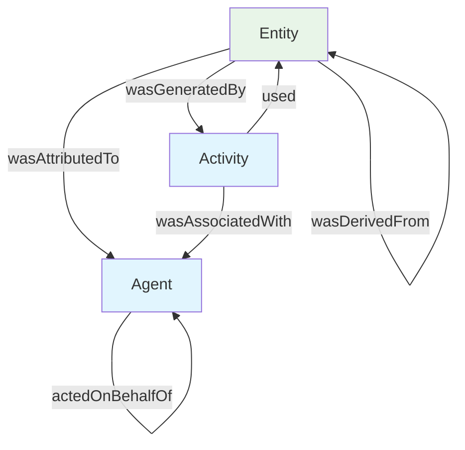
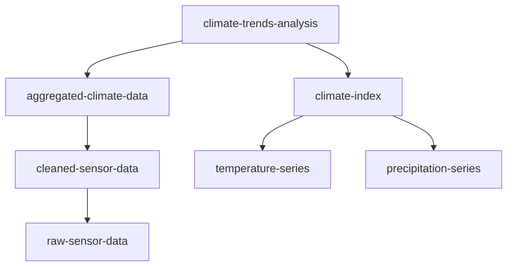
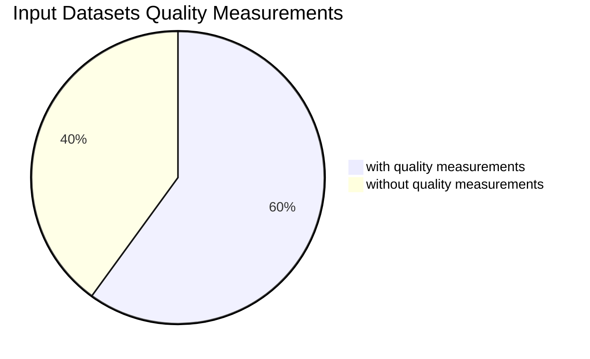

# Chapter 3: Data Lineage (PROV)

## 3.1 Theory and Concepts

Data lineage tells the story of how datasets come into existence, how they transform over time, and how they relate to one another through derivation chains. The Provenance Ontology (PROV-O) provides a standardized framework for capturing this narrative, enabling data consumers to understand the origins and transformations of datasets.

### What is PROV?

The Provenance Ontology (PROV-O) is a W3C Recommendation that defines a set of classes and properties for representing and exchanging provenance information. PROV captures the relationships between entities, activities, and agents that participate in the creation and evolution of data. PROV answers the fundamental questions about data: where did it come from, how was it transformed, and what is its relationship to other data?

### Core PROV Concepts

PROV is built around three fundamental concepts that work together to create a complete provenance story. **Entities** represent the data artifacts themselves - datasets, distributions, or any data-bearing resources. **Activities** describe the processes that transform these artifacts, though these are not currently implemented in the simple_data_catalog_model. **Agents** are the entities responsible for carrying out those activities, also not yet implemented in our model.



The current simple_data_catalog_model implements a subset of PROV concepts, focusing on entity-to-entity relationships. The `wasDerivedFrom` relationship captures how one dataset relied on another, even when the specific transformation activity is unknown. Think of this as references and the bibliography in scientific literature. This forms the foundation of provenance tracking in our data catalog, enabling the reconstruction of data processing histories.

### Provenance for Data Trust

The importance of provenance for data trust cannot be overstated. In data-driven decision making, understanding the origins and transformations of data is essential for assessing reliability and fitness for purpose. Provenance information enables data consumers to evaluate data quality, identify potential biases, and make informed decisions about data usage. It also supports regulatory compliance, scientific reproducibility, and data governance requirements.

### PROV Integration with DCAT

PROV can be combined DCAT to provide comprehensive metadata about datasets. While DCAT describes what datasets are available and how to access them, PROV explains where those datasets came from and how they relate to other datasets. This integration creates a complete picture of data resources, combining descriptive metadata with provenance information. In our implementation, this means every dataset can optionally include provenance relationships that trace its derivation from other datasets in the catalog.

In the previous chapter, we explored how to create datasets with rich descriptive metadata. Now we extend those datasets with provenance information that shows their place in the broader data ecosystem. A dataset that describes temperature readings might be derived from raw sensor data, which itself might be derived from weather station logs. This derivation chain helps users understand the processing history and assess data quality.

## 3.2 PROV in Simple Data Catalog

Simple Data Catalog implements a focused subset of PROV. The current implementation prioritizes practical usability while maintaining compatibility with the PROV-O standard. The framework provides a straightforward interface for defining derivation relationships between datasets, making provenance capture accessible without requiring deep expertise in semantic web technologies.

The current implementation includes one primary PROV property: `wasDerivedFrom`, which links datasets to their source datasets. This property follows the PROV-O specification exactly, using the standard namespace and semantics. The mapping preserves the semantic meaning of PROV while providing a user-friendly YAML format that integrates seamlessly with existing dataset metadata.

The implementation focuses on the most common provenance use case: tracking how datasets are derived from other datasets. This approach covers the majority of real-world scenarios where data consumers need to understand data origins, while keeping the complexity manageable. Future versions of the data model may expand to include full PROV support with activities and agents, but the current implementation provides a solid foundation for provenance tracking.

### Current PROV Support

| YAML Element | PROV Property | Description |
|---------------|---------------|-------------|
| `wasDerivedFrom` | `prov:wasDerivedFrom` | Links a dataset to its source datasets |
| `generatedAtTime` | `prov:generatedAtTime` | Timestamp when an entity was generated (available in QualityMeasurement) |

### Integration with DCAT

The PROV properties extend the DCAT dataset definitions from Chapter 1. Every dataset can optionally include provenance information that traces its derivation chain. This provenance information is stored alongside the descriptive metadata, creating a comprehensive view of each dataset that includes both what it contains and where it came from.

### 2.2.1 Lineage Visualization and Supply Chain Analysis

The simple_data_catalog integrates with the [simple-data-catalog-generator](https://github.com/uuidea/simple-data-catalog-generator/) library to automatically generate lineage visualizations and supply chain analysis from PROV relationships. These visualizations help users understand data dependencies and assess data quality across the entire data supply chain.

#### Lineage Diagrams

When datasets include `wasDerivedFrom` relationships, the generator creates Mermaid flowchart diagrams that visualize the complete data lineage. These diagrams show how datasets are connected through derivation relationships, making it easy to trace data transformations and identify upstream dependencies.




The lineage diagrams are automatically generated from the YAML provenance relationships and displayed on dataset detail pages. Each node represents a dataset, and arrows indicate derivation relationships following the `wasDerivedFrom` property.

#### Supply Chain Analysis

The generator also performs supply chain analysis by examining upstream data quality annotations. This analysis helps users understand the quality landscape of their data dependencies by aggregating quality measurements from all source datasets.



The supply chain analysis provides insights into **Quality Coverage**. It shows the percentage of upstream datasets that have quality measurements


#### Implementation Example

To enable lineage visualization and supply chain analysis, simply include `wasDerivedFrom` relationships in your dataset definitions:

```yaml
datasets:
  - id: climate-trends-analysis
    title: "Climate Trends Analysis Report"
    description: "Statistical analysis of long-term climate trends"
    wasDerivedFrom:
      - aggregated-climate-data
      - climate-index
    hasQualityAnnotation: true
    qualityMeasurements:
      - metric: com
      pleteness
        value: 0.95
        method: automated_check

  - id: aggregated-climate-data
    title: "Monthly Aggregated Climate Data"
    wasDerivedFrom:
      - cleaned-sensor-data
    hasQualityAnnotation: true
    qualityMeasurements:
      - metric: accuracy
        value: 0.88
        method: manual_validation

  - id: cleaned-sensor-data
    title: "Cleaned Weather Station Data"
    wasDerivedFrom:
      - raw-sensor-data
```

When processed by the simple-data-catalog-generator, this configuration will:
1. Generate a lineage diagram showing the derivation chain
2. Create a supply chain analysis showing that 2 out of 3 upstream datasets have quality measurements
3. Provide clickable navigation between related datasets

#### Benefits for Data Governance

The lineage visualization and supply chain analysis capabilities provide several benefits for data governance:

- **Transparency**: Clear visualization of data dependencies and transformations
- **Quality Assessment**: Quick identification of data quality gaps in the supply chain
- **Impact Analysis**: Understanding how changes in upstream datasets affect downstream products
- **Compliance Support**: Documentation of data provenance for regulatory requirements
- **Trust Building**: Visual evidence of data processing and quality controls

These features make the simple_data_catalog particularly valuable for organizations that need to demonstrate data governance, track data quality across complex data ecosystems, and provide stakeholders with clear understanding of data origins and reliability.

## 3.3 Practical Examples

### 3.3.1 Basic Derivation Tracking

The simplest provenance scenario involves a dataset that is directly derived from a single source dataset. This example demonstrates the fundamental PROV concept in action, showing how to document the basic story of data transformation.

```yaml
# Basic derivation example - LinkML compliant
concepts:
  - identifier: "temperature"
    prefLabel: "Temperature"
    definition: "The degree of hotness or coldness of a body or environment"
  - identifier: "climate"
    prefLabel: "Climate"
    definition: "The weather conditions prevailing in an area in general"
  - identifier: "weather"
    prefLabel: "Weather"
    definition: "The state of atmosphere at a specific time and place"

datasets:
  - identifier: "temperature-readings"
    title: "Daily Temperature Readings"
    description: "Temperature measurements collected from weather station"
    theme:
      - "temperature"
      - "climate"
      - "weather"
    publisher:
      name: "Weather Service"
    contactPoint:
      hasEmail: "data@weather.gov"
    issued: "2024-01-15"
    modified: "2024-01-20"
    distribution:
      - identifier: "csv-data"
        title: "CSV format"
        description: "Temperature data in CSV format"
        accessURL: "https://data.gov.climate/temperature.csv"
        format: "text/csv"

  - identifier: "processed-temperature-data"
    title: "Quality-Controlled Temperature Data"
    description: "Temperature measurements after quality control processing"
    theme:
      - "temperature"
      - "climate"
    publisher:
      name: "Climate Data Center"
    contactPoint:
      hasEmail: "data@climate.gov"
    issued: "2024-01-21"
    modified: "2024-01-21"
    wasDerivedFrom:
      - "temperature-readings"
```

This example shows how processed temperature data is derived from raw temperature readings. The `wasDerivedFrom` property creates a clear link between the two datasets, enabling users to trace the data processing history. The derived dataset maintains its own metadata while explicitly referencing its source, creating a transparent provenance chain.

### 3.3.2 Multi-Source Derivation

A common scenario involves datasets that are created by combining multiple source datasets. This example demonstrates how to document complex derivation relationships where a single dataset draws from multiple sources.

```yaml
# Multi-source derivation example - LinkML compliant
concepts:
  - identifier: "temperature"
    prefLabel: "Temperature"
    definition: "The degree of hotness or coldness of a body or environment"
  - identifier: "precipitation"
    prefLabel: "Precipitation"
    definition: "Any product of condensation of atmospheric water vapor"
  - identifier: "climate"
    prefLabel: "Climate"
    definition: "The weather conditions prevailing in an area in general"
  - identifier: "historical"
    prefLabel: "Historical"
    definition: "Relating to past events or periods"
  - identifier: "climate-index"
    prefLabel: "Climate Index"
    definition: "A numerical value representing climate conditions"

datasets:
  - identifier: "temperature-series"
    title: "Historical Temperature Series"
    description: "Monthly temperature measurements from 1990-2020"
    theme:
      - "temperature"
      - "historical"
      - "climate"
    temporal:
      hasBeginning: "1990-01-01"
      hasEnd: "2020-12-31"
    publisher:
      name: "National Weather Service"
    contactPoint:
      hasEmail: "data@weather.gov"

  - identifier: "precipitation-series"
    title: "Historical Precipitation Series"
    description: "Monthly precipitation measurements from 1990-2020"
    theme:
      - "precipitation"
      - "historical"
      - "climate"
    temporal:
      hasBeginning: "1990-01-01"
      hasEnd: "2020-12-31"
    publisher:
      name: "National Weather Service"
    contactPoint:
      hasEmail: "data@weather.gov"

  - identifier: "climate-index"
    title: "Combined Climate Index"
    description: "Climate index calculated from temperature and precipitation data"
    theme:
      - "climate-index"
      - "temperature"
      - "precipitation"
    temporal:
      hasBeginning: "1990-01-01"
      hasEnd: "2020-12-31"
    publisher:
      name: "Climate Research Institute"
    contactPoint:
      hasEmail: "data@climate-institute.gov"
    wasDerivedFrom:
      - "temperature-series"
      - "precipitation-series"
```

This example shows how a climate index dataset is derived from both temperature and precipitation series. The multi-valued `wasDerivedFrom` property creates links to both source datasets, documenting the complete provenance of the derived dataset. Users can trace back to understand exactly what data sources contributed to the climate index calculation.

### 3.3.3 Derivation Chains

Complex data processing workflows often create chains of derived datasets, where each step builds upon the previous one. This example demonstrates how to document multi-level derivation chains that show the complete data processing history.

```yaml
# Derivation chain example - LinkML compliant
concepts:
  - identifier: "raw"
    prefLabel: "Raw"
    definition: "Unprocessed data as originally collected"
  - identifier: "sensor"
    prefLabel: "Sensor"
    definition: "Device that detects or measures physical properties"
  - identifier: "weather"
    prefLabel: "Weather"
    definition: "The state of atmosphere at a specific time and place"
  - identifier: "cleaned"
    prefLabel: "Cleaned"
    definition: "Data that has been processed for quality control"
  - identifier: "validated"
    prefLabel: "Validated"
    definition: "Data that has undergone validation procedures"
  - identifier: "aggregated"
    prefLabel: "Aggregated"
    definition: "Data that has been combined or summarized"
  - identifier: "monthly"
    prefLabel: "Monthly"
    definition: "Data aggregated to monthly time periods"
  - identifier: "climate"
    prefLabel: "Climate"
    definition: "The weather conditions prevailing in an area in general"
  - identifier: "trends"
    prefLabel: "Trends"
    definition: "Pattern of change over time"
  - identifier: "analysis"
    prefLabel: "Analysis"
    definition: "Examination of data to extract meaning"

datasets:
  - identifier: "raw-sensor-data"
    title: "Raw Weather Station Sensor Data"
    description: "Direct readings from weather station sensors"
    theme:
      - "raw"
      - "sensor"
      - "weather"
    publisher:
      name: "Weather Station Network"
    contactPoint:
      hasEmail: "data@stations.weather.gov"

  - identifier: "cleaned-sensor-data"
    title: "Cleaned Weather Station Data"
    description: "Sensor data after automated cleaning and validation"
    theme:
      - "cleaned"
      - "validated"
      - "weather"
    publisher:
      name: "Weather Data Processing Center"
    contactPoint:
      hasEmail: "processing@weather.gov"
    wasDerivedFrom:
      - "raw-sensor-data"

  - identifier: "aggregated-climate-data"
    title: "Monthly Aggregated Climate Data"
    description: "Climate data aggregated to monthly resolution"
    theme:
      - "aggregated"
      - "monthly"
      - "climate"
    publisher:
      name: "Climate Data Center"
    contactPoint:
      hasEmail: "data@climate.gov"
    wasDerivedFrom:
      - "cleaned-sensor-data"

  - identifier: "climate-trends-analysis"
    title: "Climate Trends Analysis Report"
    description: "Statistical analysis of long-term climate trends"
    theme:
      - "trends"
      - "analysis"
      - "climate"
    publisher:
      name: "Climate Research Institute"
    contactPoint:
      hasEmail: "research@climate-institute.gov"
    wasDerivedFrom:
      - "aggregated-climate-data"
```

This example demonstrates a complete derivation chain from raw sensor data to final climate trends analysis. Each dataset in the chain explicitly references its immediate predecessor, creating a clear trail of data transformations. Users can follow this chain backward to understand the complete processing history, or forward to see how the data evolves through each processing step.

### 3.3.4 Integration with DCAT Metadata

Provenance information integrates seamlessly with the DCAT metadata structures from Chapter 1. This example shows how derivation relationships complement the descriptive metadata to create a comprehensive dataset description.

```yaml
# Complete dataset with DCAT metadata and PROV provenance - LinkML compliant
concepts:
  - identifier: "air-quality"
    prefLabel: "Air Quality"
    definition: "The degree to which air is suitable for breathing and other uses"
  - identifier: "pollution"
    prefLabel: "Pollution"
    definition: "The introduction of contaminants into natural environment"
  - identifier: "environmental"
    prefLabel: "Environmental"
    definition: "Relating to natural world and impact of human activity on it"
  - identifier: "health"
    prefLabel: "Health"
    definition: "The state of physical and mental well-being"
  - identifier: "environment"
    prefLabel: "Environment"
    definition: "The natural world and surroundings"
  - identifier: "pm25"
    prefLabel: "PM2.5"
    definition: "Particulate matter 2.5 micrometers in diameter"
  - identifier: "particulate-matter"
    prefLabel: "Particulate Matter"
    definition: "Tiny solid particles or liquid droplets suspended in air"
  - identifier: "no2"
    prefLabel: "NO2"
    definition: "Nitrogen dioxide gas"
  - identifier: "nitrogen-dioxide"
    prefLabel: "Nitrogen Dioxide"
    definition: "Chemical compound NO2, a reddish-brown gas"
  - identifier: "ozone"
    prefLabel: "Ozone"
    definition: "Triatomic molecule O3, pale blue gas"
  - identifier: "o3"
    prefLabel: "O3"
    definition: "Molecular form of ozone"

datasets:
  - identifier: "national-air-quality-index"
    title: "National Air Quality Index"
    description: "Daily air quality index calculated from multiple pollutant measurements"
    theme:
      - "air-quality"
      - "pollution"
      - "environmental"
      - "health"
      - "environment"
    temporal:
      hasBeginning: "2023-01-01"
      hasEnd: "2023-12-31"
    publisher:
      name: "Environmental Protection Agency"
    contactPoint:
      hasEmail: "data@epa.gov"
    license:
      title: "https://creativecommons.org/licenses/by/4.0/"
    wasDerivedFrom:
      - "pm25-measurements"
      - "no2-measurements"
      - "o3-measurements"
    distribution:
      - identifier: "aqi-daily-csv"
        title: "Daily AQI CSV Data"
        description: "Air quality index values in CSV format"
        accessURL: "https://data.epa.gov/aqi/daily/2023.csv"
        format: "csv"
      - identifier: "aqi-api"
        title: "AQI REST API"
        description: "Real-time air quality index API"
        accessURL: "https://api.epa.gov/aqi/v1"
        conformsTo: "https://api.epa.gov/docs/aqi/v1"

  - identifier: "pm25-measurements"
    title: "PM2.5 Concentration Measurements"
    description: "Particulate matter 2.5 micrometer measurements from monitoring stations"
    theme:
      - "pm25"
      - "particulate-matter"
      - "pollution"
    publisher:
      name: "Air Quality Monitoring Network"
    contactPoint:
      hasEmail: "data@air-quality.gov"

  - identifier: "no2-measurements"
    title: "NO2 Concentration Measurements"
    description: "Nitrogen dioxide measurements from monitoring stations"
    theme:
      - "no2"
      - "nitrogen-dioxide"
      - "pollution"
    publisher:
      name: "Air Quality Monitoring Network"
    contactPoint:
      hasEmail: "data@air-quality.gov"

  - identifier: "o3-measurements"
    title: "Ozone Concentration Measurements"
    description: "Ground-level ozone measurements from monitoring stations"
    theme:
      - "ozone"
      - "o3"
      - "pollution"
    publisher:
      name: "Air Quality Monitoring Network"
    contactPoint:
      hasEmail: "data@air-quality.gov"
```

This comprehensive example shows how provenance information enhances the rich DCAT metadata from Chapter 1. The national air quality index dataset includes complete descriptive metadata while also documenting its derivation from three pollutant measurement datasets. This integration creates a complete picture that tells users both what the dataset contains and where it came from.

<!-- ### 3.3.5 Version Control and Provenance

Data catalogs often need to track how datasets evolve over time. While PROV provides mechanisms for versioning through derivation relationships, simple_data_catalog_model allows you to document dataset evolution using the `version` property combined with provenance relationships.

```yaml
# Version control with provenance
datasets:
  - id: climate-data-v1
    title: "Climate Dataset Version 1.0"
    description: "Initial version of climate measurements dataset"
    version: "1.0"
    issued: "2023-01-15"
    publisher:
      name: "Climate Data Center"
      email: "data@climate.gov"

  - id: climate-data-v2
    title: "Climate Dataset Version 2.0"
    description: "Updated climate dataset with additional stations and improved quality control"
    version: "2.0"
    issued: "2023-06-01"
    publisher:
      name: "Climate Data Center"
      email: "data@climate.gov"
    wasDerivedFrom:
      - climate-data-v1

  - id: climate-data-v3
    title: "Climate Dataset Version 3.0"
    description: "Latest version with extended temporal coverage and new variables"
    version: "3.0"
    issued: "2024-01-15"
    publisher:
      name: "Climate Data Center"
      email: "data@climate.gov"
    wasDerivedFrom:
      - climate-data-v2
```

This example demonstrates how to track dataset versions using explicit derivation relationships. Each version references its predecessor, creating a clear lineage of dataset evolution. This approach helps users understand how datasets have changed over time and choose appropriate versions for their needs. -->

### 3.3.6 Cross-Referencing Provenance

When documenting provenance across multiple datasets, you may need to reference datasets that are defined in separate YAML files or in other catalogs. PROV supports this through the use of full dataset identifiers.

```yaml
# Cross-referencing provenance example - LinkML compliant
concepts:
  - identifier: "temperature"
    prefLabel: "Temperature"
    definition: "The degree of hotness or coldness of a body or environment"
  - identifier: "global"
    prefLabel: "Global"
    definition: "Relating to the entire world or earth"
  - identifier: "historical"
    prefLabel: "Historical"
    definition: "Relating to past events or periods"
  - identifier: "regional"
    prefLabel: "Regional"
    definition: "Relating to a specific geographic region"

datasets:
  - identifier: "https://data.weather.gov/datasets/temperature-series"
    title: "Historical Temperature Series"
    description: "Global temperature measurements from 1880-2020"
    theme:
      - "temperature"
      - "global"
      - "historical"
    publisher:
      name: "Global Climate Organization"
    contactPoint:
      hasEmail: "data@globalclimate.org"

  - identifier: "local-climate-analysis"
    title: "Regional Climate Impact Analysis"
    description: "Regional analysis based on global temperature data"
    theme:
      - "regional"
      - "climate"
    publisher:
      name: "Regional Climate Center"
    contactPoint:
      hasEmail: "data@regional-climate.gov"
    wasDerivedFrom:
      - "https://data.weather.gov/datasets/temperature-series"
```

This example shows how to reference datasets in external catalogs using their full identifiers. This approach enables provenance tracking across organizational boundaries, supporting federated data catalogs and collaborative data ecosystems.

## 3.4 Current Limitations and Future Enhancements

### Current Implementation Limitations

The current simple_data_catalog_model implements a focused subset of PROV that prioritizes practical usability over comprehensive provenance tracking. This approach has several limitations that users should understand:

**Missing PROV Concepts**: The current implementation does not include:
- **Activities**: Processing steps that transform data
- **Agents**: People, organizations, or software responsible for activities
- **Temporal properties**: `startedAtTime`, `endedAtTime` for activities
- **Qualified relationships**: Detailed attribution, usage, or generation information
- **Complex derivation types**: Specialization, revision, quotation relationships

**Limited Provenance Depth**: Current implementation only supports:
- Simple entity-to-entity derivation relationships
- Basic attribution through dataset publishers. 

### Future Enhancement Roadmap

The simple_data_catalog_model roadmap includes plans for progressive PROV enhancement:


- Import of full LinkML PROV schema
- Activity definitions with temporal properties
- Agent classes (Person, Organization, SoftwareAgent)


### Migration Strategy

When future enhancements are implemented, existing YAML configurations will remain backward compatible. New properties will be added as optional elements, allowing gradual adoption of enhanced provenance features.

## Best Practices

Effective provenance documentation with current capabilities requires attention to several key principles:

**Document Derivations Clearly**: Always include `wasDerivedFrom` relationships when datasets are created from other datasets. This creates essential provenance chains that users can follow to understand data origins.

**Maintain Consistent Identifiers**: Use stable, unique identifiers for all datasets that may be referenced in provenance relationships. Consider using persistent URLs or DOI-style identifiers for important datasets.

**Balance Detail and Usability**: While provenance information is valuable, avoid creating overly complex derivation chains that might confuse users. Focus on the most important source datasets that users would want to understand.

**Update Provenance Regularly**: When datasets are updated or reprocessed, update their `wasDerivedFrom` relationships to reflect current processing history. Outdated provenance information can mislead users about data quality and reliability.

**Consider Cross-Organizational Needs**: When working with data from multiple organizations, use full identifier URLs that can be resolved across domains. This supports federated provenance tracking and collaboration.

**Document Processing Context**: Even though activities are not currently supported in the data model, include relevant processing information in dataset descriptions or documentation to help users understand derivation context.